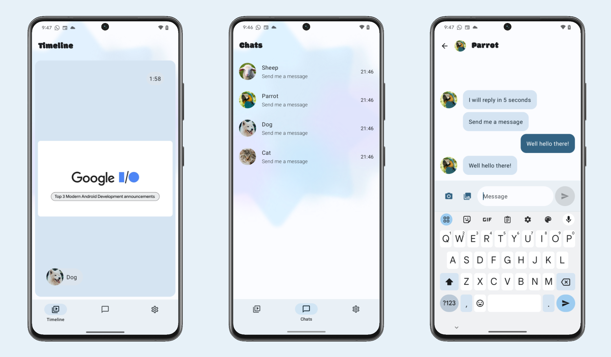

# SociaLite: An Android Sample App

SociaLite demonstrates how to use various Android platform APIs to implement features that
are commonly seen in social network apps, leveraging a variety of
[Jetpack APIs](https://developer.android.com/jetpack/getting-started) to achieve complex
functionality that works reliably on more devices and requires less code. These are some of the
Jetpack APIs used:

 - [Core](https://developer.android.com/jetpack/androidx/releases/core) Notifications and other platform features
 - [Compose](https://developer.android.com/jetpack/androidx/releases/compose) Declarative UI generation
 - [Media3](https://developer.android.com/jetpack/androidx/releases/media3) Displaying and editing photos and videos
 - [CameraX](https://developer.android.com/jetpack/androidx/releases/camera) Capturing photos and videos
 - [Room](https://developer.android.com/jetpack/androidx/releases/room) Persisting messages in a SQLite database
 - [Window](https://developer.android.com/jetpack/androidx/releases/window) Detecting foldable device states

The app also integrates the Gemini API that powers chatbot capabilities:

 - [Google AI Client SDK](https://developer.android.com/ai/google-ai-client-sdk) Generative AI with Gemini 1.5 Flash


> 🚧 **Work-in-Progress:** This sample is still in the early stage of development, and we're excited to add more features over time.

## App Overview



The main interaction in SociaLite centers around the animal avatars and their associated chat
threads. When you send a message to one of these avatars, they will respond in 5 seconds. If you
close the app within that time and you've granted notification permissions, you'll see a
notification for that reply.

Here are the screens that make up SociaLite:

 - *Timeline Screen:* A vertical scrolling page of all of the photos and videos sent in chats.
 - *Chat List Screen:* A list of all the chat threads with a variety of animal personalities.
 - *Chat Screen:* An individual message thread where you can send text and media
    messages (from the in-app camera or with a
    [Photo Picker](https://developer.android.com/training/data-storage/shared/photopicker)).
 - *Camera Screen:* Clicking the camera icon in the Chat Screen opens the in-app camera for taking photos and videos.
 - *Video Edit Screen:* After taking a video with the in-app camera, users can do some minor edits on this screen.
 - *Settings Screen:* A basic settings screen for tasks like resetting the chat history.

## Project Structure

The project is organized into several modules and directories:

-   `app/`: Contains the main Android application code.
    -   `src/main/`: Source code and resources for the main application.
        -   `java/`: Kotlin/Java source files.
            -   `com/google/android/samples/socialite/`: The main package for the application. See the [README](app/src/main/java/com/google/android/samples/socialite/README.md) for more details.
                -   `data/`: Data sources, repositories, and related logic. See the [README](app/src/main/java/com/google/android/samples/socialite/data/README.md) for more details.
                -   `model/`: Data models and entities. See the [README](app/src/main/java/com/google/android/samples/socialite/model/README.md) for more details.
                -   `ui/`: UI components, screens, and view models. See the [README](app/src/main/java/com/google/android/samples/socialite/ui/README.md) for more details.
                    -   `camera/`: Code related to the in-app camera feature. See the [README](app/src/main/java/com/google/android/samples/socialite/ui/camera/README.md) for more details.
                    -   `chat/`: Code for the chat list and individual chat screens. See the [README](app/src/main/java/com/google/android/samples/socialite/ui/chat/README.md) for more details.
                    -   `settings/`: Code for the settings screen. See the [README](app/src/main/java/com/google/android/samples/socialite/ui/home/settings/README.md) for more details.
                    -   `timeline/`: Code for the timeline screen. See the [README](app/src/main/java/com/google/android/samples/socialite/ui/home/timeline/README.md) for more details.
                    -   `videoedit/`: Code for the video editing screen. See the [README](app/src/main/java/com/google/android/samples/socialite/ui/videoedit/README.md) for more details.
        -   `res/`: Application resources (layouts, drawables, values, etc.).
        -   `assets/`: Static assets like images and shaders.
    -   `build.gradle.kts`: Gradle build file for the app module.
-   `baselineprofile/`: Contains code for generating baseline profiles to improve app performance.
-   `docs/`: Documentation and images.
-   `gradle/`: Gradle wrapper files.
-   `build.gradle.kts`: Top-level Gradle build file.
-   `settings.gradle.kts`: Gradle settings file.
-   `gradle.properties`: Gradle properties file.
-   `libs.versions.toml`: Version catalog for dependencies.

## How to run SociaLite

1. Clone the repository
2. Open the whole project in Android Studio.
3. Sync & Run `app` configuration

### (optional) Add Gemini API via Firebase AI Logic:
4. Set up a Firebase Project, connect your app to the _Gemini Developer API_ by following [these steps](https://firebase.google.com/docs/ai-logic/get-started?platform=android&api=dev),
5. Replace google-services.json with your own & Run `app` configuration,
6. In the app, go to Settings and tap the "AI Chatbot" button.

## Reporting Issues

You can report an [issue with a sample](https://github.com/android/socialite/issues) using
this repository. When doing so, make sure to specify which sample you are referring to.

## Contributions

Please contribute! We will gladly review any pull requests.
Make sure to read the [Contributing](CONTRIBUTING.md) page first though.

> Note: make sure to run `./gradlew spotlessApply` before uploading a PR.

## License

```
Copyright 2023 The Android Open Source Project
 
Licensed under the Apache License, Version 2.0 (the "License");
you may not use this file except in compliance with the License.
You may obtain a copy of the License at

    https://www.apache.org/licenses/LICENSE-2.0

Unless required by applicable law or agreed to in writing, software
distributed under the License is distributed on an "AS IS" BASIS,
WITHOUT WARRANTIES OR CONDITIONS OF ANY KIND, either express or implied.
See the License for the specific language governing permissions and no
limitations under the License.
```
